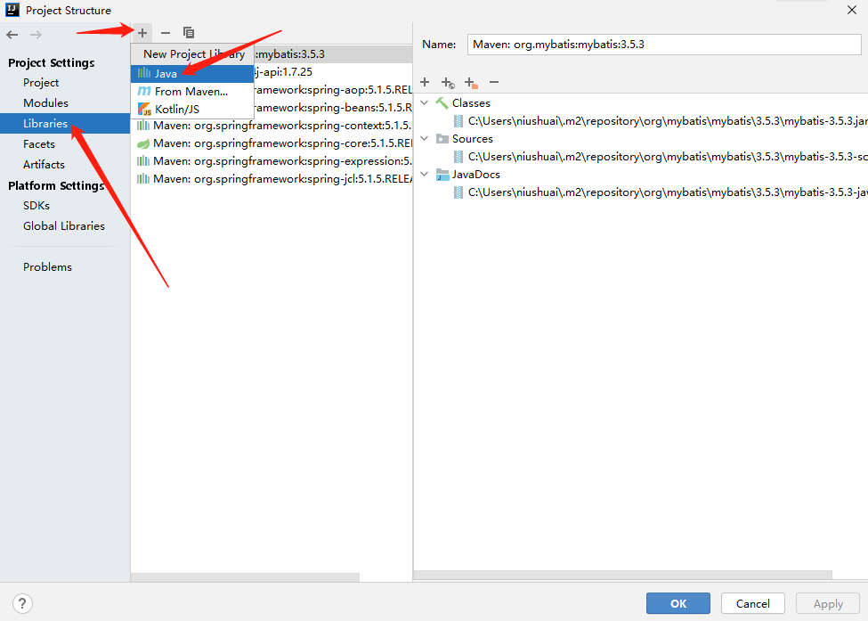
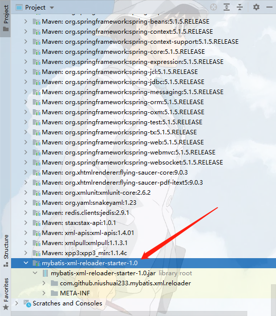
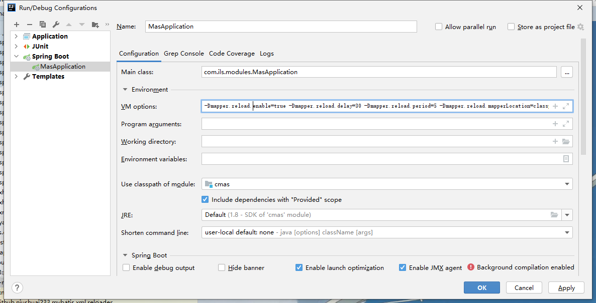

# mybatis-xml-reloader-starter
加载到项目中可以修改 [*Mapper.xml] 文件后不用重启即可生效


# 自行编译jar包

```nginx
mvn clean package
```

`target` 目录下得到 `mybatis-xml-reloader-1.0.jar`

# 使用方法

## 1、将jar使用maven引入使用

### 	1.1、安装到本地仓库或私服中

​				方法自行百度

### 	1.2、使用systemPath标签

​				方法自行百度

## 2、将jar使用IDE引入使用

​	idea可以使用Ctrl + Alt + Shift + S 进入工程配置页签



在弹出的选择框内选择jar包位置即可添加

成功后在工程中会如下所示




添加成功后 加入启动参数





```java
-Dmapper.reload.enable=true // 是否启动该功能  必须 默认false
-Dmapper.reload.delay=30 // 初始延迟 即delay秒后才开始扫描变更 非必填 默认
-Dmapper.reload.period=5 // 扫描间隔 5s 非必填 默认3s
-Dmapper.reload.mapperLocation=classpath*:mapper/**/*Mapper.xml  // mapper位置 必填
```

当然 也可以把配置放入yml或者Properties文件中


**推荐该种方式，对工程完全没有侵入性**